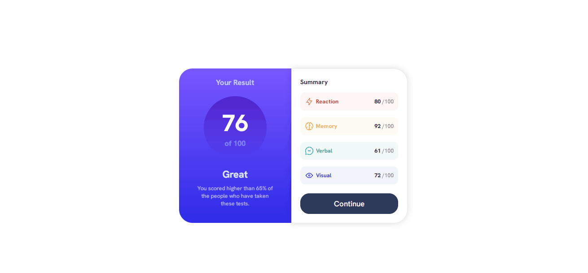
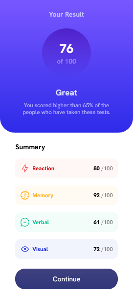

# Frontend Mentor - Results summary component solution

This is a solution to the [Results summary component challenge on Frontend Mentor](https://www.frontendmentor.io/challenges/results-summary-component-CE_K6s0maV). Frontend Mentor challenges help you improve your coding skills by building realistic projects. 

## Table of contents

- [Overview](#overview)
  - [The challenge](#the-challenge)
  - [Desktop](#desktop)
  - [Mobile](#mobile)
  - [Links](#links)
  - [Built with](#built-with)

## Overview

### The challenge

Users should be able to:

- View the optimal layout for the interface depending on their device's screen size ✅
- See hover and focus states for all interactive elements on the page ✅

## Desktop

 

## Mobile

### Links

- Solution URL: <a href="https://www.frontendmentor.io/solutions/results-summary-with-flexbox-nxY_CXSY9y">Frontend Mentor</a>
- Live Site URL: <a href="https://felipe-ma1a.github.io/frontend-mentor-results-summary/">Github Pages</a>

## Built with

- Flexbox
